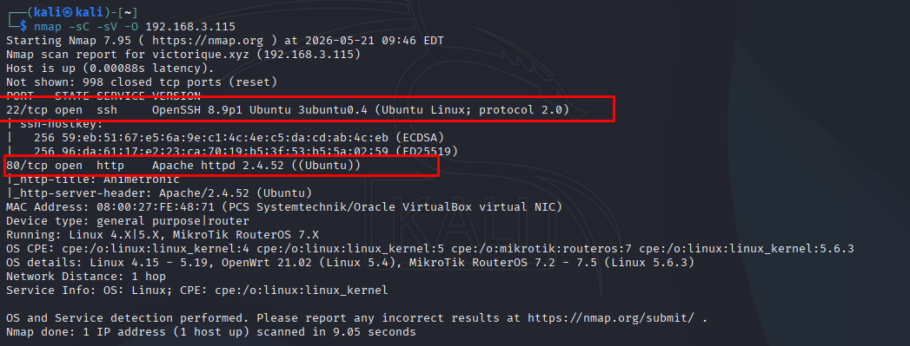

# Animetronic

[https://hackmyvm.eu/machines/machine.php?vm=Animetronic](https://hackmyvm.eu/machines/machine.php?vm=Animetronic)

#### **USER FLAG**

We initiate the process by running an `nmap` port scan, identifying two active services corresponding to two open ports on the target machine:

* **SSH** on `port 22`
* **HTTP** on `port 80`

Since we currently have `no credentials` (username or password) to authenticate directly via `port 22`, we will `focus our attention` on exploiting the `web application` running on port 80.



Upon attempting to access the website, we encounter a forbidden/default page ⇒ indicating we must perform Fuzzing to discover hidden directories.


After an initial fuzzing pass, I identified the response size that produces **false positives**. Consequently, I appended the `-fs 278` flag to filter these out while fuzzing using the wordlist `/usr/share/wordlists/dirbuster/directory-list-2.3-medium.txt`.

The most suspicious directory found is `staffpages` **(pages dedicated to employees)**, as the `other directories` are merely standard defaults of the Apache web server. As a rule of thumb, I always prioritize custom-built directories like `staffpages`. If this path reaches a dead end, we can revert to scanning the `js` directory for hidden API keys, or inspect the `img` directory for files hidden via steganography. 

Attempting to access it directly returns a 403 Forbidden error, so we continue to dig deeper to find hidden subdirectories/files inside it, which reveals an image file named `new_employees`:

`ffuf -u http://192.168.3.115/FUZZ -w /usr/share/wordlists/dirbuster/directory-list-2.3-medium.txt -e .txt,.html -fs 278`


After locating the hidden file, accessing it reveals an image containing no visible text or clues. I decided to download the image for deeper analysis using the **`strings`** utility to **extract readable ASCII text**, filtering out the binary junk of the image file:

`wget http://192.168.3.115/staffpages/new_employees -O new_emp.jpg`

`strings new_emp.jpg`


I noticed a base64-encoded string, which decodes to an upside-down string: **`ɯǝssɐƃǝ‾ɟoɹ‾ɯıɔɥɐǝן`**.
Flipping this string 180 degrees (Flip Text) yields the complete path:

**`message_for_michael`**

This is undoubtedly a clue pointing to the next hidden endpoint left by the author. I will navigate directly to this new path to search for information regarding the user `michael`:

`http://192.168.3.115/staffpages/message_for_michael`


Accessing this path provides a hint, which points to a directory containing Michael's personal details.

At this point, we have successfully harvested key pieces of data:

1. **Username:** `michael` (confirmed in the "Hi Michael" letter).
2. **Password Clue:** The letter reveals that Michael's password was generated by combining his personal details located in the `personal_info.txt` file.

⇒ **Strategy:** Since humans frequently set passwords by combining names, birthdates, hobbies, etc. (**these highly personalized passwords will definitely not be in standard wordlists like rockyou.txt**), I will:

- Use **CUPP** (Common User Passwords Profiler) on Kali Linux to input Michael's personal information (birthdate, children's names: Ahmed, Yasser, Adam, and hobby: swimming) to automatically generate a **personalized password dictionary** tailored for Michael.
- Perform a **brute-force attack on the SSH service (Port 22)** using this custom dictionary against the username `michael`. Once the correct password is found, we can log in directly to retrieve the User Flag!


I launch the tool and input the core details we gathered:

- First Name: Michael
- Birthdate: 19101996
- Child's name: Ahmed

For the remaining fields, I press Enter to skip, while enabling options to append random numbers, special characters, and Leet mode to thoroughly sweep all potential password variations. After `cupp` successfully generates the personalized wordlist `michael.txt`, I use `hydra` to brute-force the SSH service on port 22 with the username `michael`:

```
hydra -l michael -P michael.txt ssh://192.168.3.115 -t 4
```


The tool successfully recovers the credentials: username `michael` and password `leahcim1996`. I immediately log in via SSH.

Once inside the system as `michael`, I begin scanning local directories. Checking the `/home` directory, I discover another user folder named `henry`. I navigate to `/home/henry` and list the contents. Here, I spot two highly critical files: `user.txt` and `Note.txt`. Reading `user.txt` yields the **User Flag**:


> **User Flag:** `0833990328464efff1de6cd93067cfb7`

**User Flag Acquired.**

---

#### **ROOT FLAG**

Upon establishing our initial shell session as `michael`, I sought a direct path to escalate privileges to `root`. I audited `michael`'s privilege configurations:

- Checking Sudo privileges (`sudo -l`): The system prompts for `michael`'s password, and this account has no special privileges defined in `/etc/sudoers`.
- Scanning for SUID binaries (`find / -perm -u=s -type f 2>/dev/null`): No abnormal or exploitable binaries were found.

At this point, it became clear that a direct vertical escalation from `michael` to `root` was blocked. This forced a pivot in strategy toward **lateral movement**: finding a path to transition to another user with broader system privileges.

The accessible `/home/henry` directory containing the `user.txt` flag and `Note.txt` password clue is the exact pivot point. Henry is clearly a user with higher privileges or looser configurations. The `Note.txt` file containing a hidden password is the key set by the lab author to guide us through this lateral privilege escalation chain: **Michael -> Henry -> Root**.

After capturing the user flag, I read `Note.txt` to find the next privilege escalation clue. The file contains a message from Henry stating he hid his password in an obscure file, along with a Base64-encoded string:

```
echo "<aGVucnlwYXNzd29yZC50eHQK>" | base64 -d
```


Decoding this Base64 string points to a hidden file containing Henry's password: `henrypassword.txt`. After locating and reading `henrypassword.txt`, I retrieve the plaintext password for `henry`: **`IHateWilliam`**. I execute the switch user command to transition to `henry`'s session:

```
su henry
```

Inputting the password `IHateWilliam` successfully logs us in as `henry`. Now that we control `henry`, our ultimate objective is to compromise the entire server (`root`).

The classic starting point for Linux privilege escalation is to check what commands the current user is permitted to execute as root without a password via sudoers:

```
sudo -l
```


The system returns a highly vulnerable configuration: the user `henry` is allowed to run the `/usr/bin/socat` binary as `root` without a password (`(root) NOPASSWD: /usr/bin/socat`).

`socat` is an extremely powerful utility for transferring data between two streams. Allowing it to run with `root` privileges means we can instruct `socat` to execute `/bin/bash` and attach it to our standard input/output streams.


I query GTFOBins and craft the custom payload to perform the privilege escalation:

```
sudo socat - exec:/bin/bash
```


The command executes successfully, granting us a root shell. I read the final flag:

> **Root Flag:** `153a1b940365f46ebed28d74f142530f280a2c0a`

**Root Compromised.**


---

#### **ATTACK KILL CHAIN & EXPLOITATION FLOW**

To visualize the complete exploitation flow of this lab, from initial external reconnaissance to complete server compromise:

**Phase 1: Gaining Initial Access (User: michael)**
1. **Network Discovery:** Run `arp-scan` to identify the target IP, followed by `nmap` scanning to map open ports: `22 (SSH)` and `80 (HTTP)`.
2. **Web Reconnaissance:** Accessing Port 80 reveals a blank default Apache landing page. To eliminate false-positive responses from wildcard vhosts, we filter ffuf results using `-fs 278`, revealing the `/staffpages/` directory.
3. **Information Disclosure:** Recursive fuzzing inside `/staffpages/` exposes `/staffpages/new_employees`. Extracting strings from the image yields the base64-encoded upside-down string decoding to `/staffpages/message_for_michael`.
4. **Targeted OSINT & Profiling:** Inside this hidden directory, we find `personal_info.txt` containing Michael's personal details.
5. **Custom Password Profiling:** We feed these personal details into `cupp` to generate a highly focused, personalized dictionary (`michael.txt`).
6. **Active Brute Force:** We execute `hydra` against SSH using our custom wordlist, successfully recovering the credentials: `michael:leahcim1996`.

**Phase 2: Lateral Movement & Privilege Escalation**
1. **Local Enumeration:** Initial vertical escalation checks for `michael` yield no results. We shift to lateral movement, inspecting `/home/henry`.
2. **Credential Harvesting:** We retrieve the User Flag from `user.txt` and decode the base64 string in `Note.txt`, pointing to the hidden `henrypassword.txt` containing `IHateWilliam`.
3. **Lateral Pivot:** We pivot to `henry` using `su henry`.
4. **Root Privilege Escalation:** Running `sudo -l` reveals a NOPASSWD entry for `/usr/bin/socat`. We execute `sudo socat - exec:/bin/bash` to spawn an interactive root shell and retrieve the root flag.

---

#### **KEY TAKEAWAYS & LESSONS LEARNED**

1. **Leveraging Negative Filters in Fuzzing:** When dealing with servers configured with wildcard catch-all routing (resulting in generic 403/200 responses), standard error-code filtering (`-fc`) fails. Identifying and filtering by response size (`-fs`) is critical to isolating genuine endpoints.
2. **Steganographic Analysis of Assets:** Media files on a target system should never be assumed to be purely decorative. Running standard checks like `strings` or `exiftool` on discovered assets is a mandatory step in comprehensive enumeration.
3. **The Risk of Personalized Passwords:** Users notoriously generate passwords using predictable personal elements (names, birthdates, reversed strings). Using OSINT profiling tools like `cupp` to build targeted dictionaries is vastly more efficient than brute-forcing with generic wordlists like `rockyou.txt`.
4. **Lateral Movement as an Escalation Path:** When direct vertical paths to root are blocked, pivoting laterally to adjacent user accounts often uncovers weaker configurations or stored credentials that bridge the gap to root.
5. **The Principle of Least Privilege:** Granting NOPASSWD sudo access to highly versatile utility binaries like `socat` is a severe security risk. Any binary capable of executing shells or redirecting streams must be strictly restricted.
