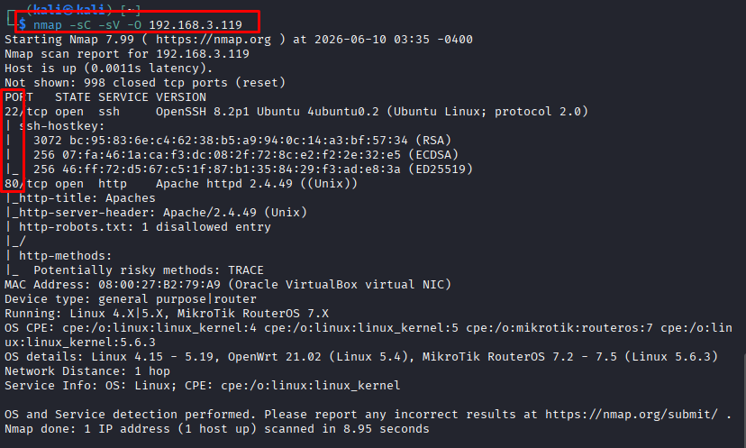

# Apaches

# **I.USER FLAG**

#### ATTACK SURFACE



When entering a black-box environment, after identifying the target IP, the first step is to use Nmap to scan for open ports and services.

The returned results show that the target machine is running 2 main services:

- **Port 22 (SSH):** Usually requires credentials (user/pass or key), so it will be temporarily set aside. I will only return to this port when I have exploited information from other angles.
- **Port 80 (HTTP):** Running the web service **Apache 2.4.49**. This is the most accessible main attack surface. The thinking here is to focus on exploiting the web first.

However, before accessing the main web interface directly, I will check hidden paths via the `robots.txt` file using the cURL tool.


After cURLing, I clearly noticed that this is a base64 encoded block. I decoded it and received the author's hint, which made me even more confident in my reasoning, therefore I accessed the website directly.


I accessed it and from here I surveyed the attack surface as well as easily exploitable points. Following the next line of thinking, at this point I completely did not know what to do yet, I saw that it has **CONTACT**, which is likely where vulnerabilities occur most easily. Combined with the fact that I previously discovered this web is running a **rather old Apache version 2.4.49**, I thought that an RCE vulnerability on the system is likely to occur here, so I used the searchsploit (Exploit-DB) tool to search for public exploit codes for this Apache version 2.4.49.


I identified that the main security vulnerability to care about is **CVE-2021-41773: Apache HTTP Server 2.4.49** - Path Traversal and Remote Code Execution.


#### **Deep analysis of the working mechanism of CVE-2021-41773:**

Instead of blindly using an automated script, we need to analyze the exploit source code to understand the root cause of this vulnerability. The core payload lies in the following command:

```
curl -s --path-as-is -d "echo Content-Type: text/plain; echo; $3" "$host/cgi-bin/.%2e/%2e%2e/%2e%2e/%2e%2e/%2e%2e/%2e%2e/%2e%2e/%2e%2e/%2e%2e/%2e%2e$2"; done
```

This vulnerability is a combination of 3 factors:

**1. Logic Error in the Path Normalization Function (Path Normalization Flaw):** Normally, Apache will block `../` sequences to prevent Path Traversal. However, it does not thoroughly process when the dot character (`.`) is URL-encoded. Therefore, the sequence `.%2e/` or `%2e%2e/` easily bypasses Apache's filter, allowing the attacker to traverse backward to escape from the safe space (web root) of the server.

**2. 'Spam Traversal' Technique to reach the system bottom:** In the payload, we see a long, repeating sequence of directory traversal characters: `.%2e/%2e%2e/...`. The reason for repeating it so many times is that from a Black-box attack perspective, we do not know exactly how many levels deep the current web directory is relative to the operating system's root directory. However, the Linux directory structure has a characteristic: if we are at the root directory `/`, any subsequent backward directory command (`cd ..`) is ignored and we will still remain at `/`. Therefore, 'spamming' dozens of redundant traversal commands ensures we will 100% reach the system root directory `/`, and from there precisely match the path `/bin/sh`.

**3. Leveraging the CGI feature to upgrade from 'File Reading' to 'Command Execution' (Traversal to RCE):** If we only do normal directory traversal, we can only read sensitive files (such as `/etc/passwd`). But the key point to achieve Remote Code Execution (RCE) here is to exploit the `/cgi-bin/` directory (where Apache grants permission to execute scripts). By sending the payload through `/cgi-bin/`, Apache is tricked into thinking the file `/bin/sh` (a valid Linux shell located outside the web root) is a legitimate CGI script. Apache will obediently call `/bin/sh` to run. Finally, the `-d` flag of cURL will push data via the HTTP POST method into the input stream (stdin) of `/bin/sh`, forcing the system to execute the command we want.


Thus, I successfully achieved RCE. After getting into the system, I immediately established a **Reverse Shell**


Successfully established **Reverse Shell**

# II.**Enumeration**

After getting into the system, I proceeded to list the information that I could gather in the home directory. My ultimate goal was to obtain `root` privileges. Therefore, I had to find a way to perform **Privilege Escalation**


Checking the content of the `/etc/passwd` file, we notice that the password field for all users is marked with the character `x`. This proves that the system has moved all passwords to be stored in the `/etc/shadow` file for security.

According to the standard Linux permission principle, the `/etc/shadow` file can only be read by `root` privilege. However, upon testing, we discover a **serious configuration vulnerability (Misconfiguration)**: the administrator granted read permission for this file to all users. The evidence is that we can use the `cat` command to read its entire contents even though we only have `daemon` privileges.

The returned results show the password hashes of the 4 target users (`geronimo`, `squanto`, `sacagawea`, `pocahontas`) using the SHA-512 hashing algorithm (identified by the prefix `$6$`). The next step is to extract these password hashes to our local machine and use the Offline Password Cracking technique to find the original passwords.

#### Cracking data


Proceeding to save the gathered hashes into `hash.txt` on the attack workstation, we use the specialized password cracking tool **John the Ripper** combined with the popular dictionary file **rockyou.txt** to perform a dictionary attack. The tool successfully cracked and returned the result: the password of the user `squanto` is `iamtheone`.

We proceed to SSH in with the obtained username and password to prepare for privilege escalation


Infiltration successful!


Proceeding to read the file contents (`cat user.txt`), we officially obtain the **User Flag**, confirming the successful infiltration and takeover of the user. A rather interesting point is that the author of this VM used ASCII Art to display the flag with the text "Flag of squanto" instead of a character string format.

Collecting the **User Flag** marks the successful completion of the initial entry phase (Foothold). The battle shifts to the final stage: **Local Enumeration (Internal Information Gathering)** to search for configuration weaknesses, aiming to perform **Privilege Escalation** to the highest administrator privilege (`root`).

# **III. PRIVILEGE ESCALATION (Privilege Escalation)**

### **Privilege Escalation Path Diagram (Privilege Escalation Path):**

The system has multiple different user accounts. The detailed exploit path goes through the following steps:
squanto (Initial Shell) ──> sacagawea (Cronjob SUID) ──> pocahontas (Cleartext Creds) ──> geronimo (Sudo Nano Escape) ──> root (LXD Container escape)

- Privilege escalation path diagram
1. Lateral movement (squanto -> sacagawea -> pocahontas -> geronimo)
2. Privilege escalation to the highest privilege (geronimo -> root)

### Lateral Escalation

#### **Escalation from squanto -> sacagawea**


After obtaining the **Interactive Shell**, the first step in my Privilege Escalation process is always to check the existing sudo privileges (`sudo -l`). However, the user `squanto` is not granted any sudo privileges on the system. The path straight to **root** is temporarily blocked, forcing me to redirect to a lateral movement attack to another user with more privileges.

Proceeding to review the current user's identification information (`id`), I discovered that besides the default group, `squanto` is also assigned to an unusual group named **`Lipan`**. Continuing to gather information about system background tasks (Cron jobs) by reading the `/etc/crontab` file, I discovered a hint deliberately left by the author as a comment (`#`): a script named `backup.sh` is set up to run periodically under the privileges of the user `sacagawea`.

⇒ I checked the permissions of this target script file (`ls -la /home/sacagawea/Scripts/backup.sh`). The result was exactly as predicted: the script file grants full `rwx` permissions to the **`Lipan`** group.

**Thinking:** Since `squanto` is a member of the `Lipan` group, we have full permission to modify the content of the `backup.sh` file. The next plan is to inject malicious code into this script. When the system automatically executes the script according to the schedule under the privileges of `sacagawea`, the malicious code will be triggered, and I will successfully take control of this user.


Executing the command to insert malicious code (payload) into the `backup.sh` file: `echo "cp /bin/bash /tmp/sacabash && chmod +s /tmp/sacabash" >> /home/sacagawea/Scripts/backup.sh`

After that, I redirected to the `/tmp` directory and continuously monitored the appearance of the `sacabash` file. Since the cron job is set up to run periodically every minute, just a short time later, the bash file carrying the **SUID** (Set Owner User ID) flag of the user `sacagawea` was successfully generated (`-rwsr-sr-x`).

Proceeding to activate this executable file with the `-p` (privileged) parameter to preserve privileges: `/tmp/sacabash -p`

The new shell version was spawned successfully. Checking the identification (`id`), we confirm that the EUID has now changed to `sacagawea` (EUID=1002). Reading the `user.txt` file in the home directory, we successfully gather the second flag of the lab, completing the lateral movement.

**Next goal**: Use the privileges of `sacagawea` to continue scanning the system, finding the path to escalate privileges to `root`.

Flag sacawagea : FlagsNeverQuitNeitherShouldYou


#### **Escalation from sacagawea -> pocahontas**

**Exploitation Thinking:** As **sacagawea**, we proceed to check this user's home directory to search for information. The search steps are as follows:

- First, checking the home directory reveals the **Development** and **Backup** directories. The **Development** directory is the most noteworthy because it usually stores web source code.
- Going deep into the **Development** directory, I discovered the structure of a website and the **admin** subdirectory.
- In the **admin** directory, I discovered the file **2-check.php** (login check functionality). This file directly stores a pre-defined array of accounts and passwords in cleartext (unencrypted original passwords) of other users, including **pocahontas**. I retrieved this password to switch users.


#### **Escalation from pocahontas -> geronimo**


**Exploitation Thinking:**

After switching to user `pocahontas`, the first step is to check the privileges to execute commands under **admin** without a password using the `sudo -l` command. The result shows that `pocahontas` is allowed to run the text editor `/bin/nano` on behalf of the user `geronimo` without having to enter a password.


Looking up GTFOBins, I knew that `nano` can be exploited to escape to a system shell (spawn shell) while preserving the privileges of the command-executing user (here, `geronimo`).


Infiltration successful!

### **Privilege escalation to the highest privilege (geronimo -> root)**

**Exploitation Thinking:**

Once I became `geronimo`, I checked the identification information with the `id` command. I noticed that this user belongs to the `lxd` group (LXD Container). Members of the `lxd` group have the right to manage and configure containers on the system. This configuration flaw allows me to create a new container with the highest privilege (`security.privileged=true`), then mount the entire host hard drive partition (`/`) directly inside the `/mnt/root` directory of the container. In this way, I can access, read, and overwrite any file on the host machine with actual `root` privileges from within the container.

**Steps to perform:**

1. Check user group:
    
    ```
    id
    ```
    
2. Import the prepared Alpine image to LXD:
    
    ```
    lxc image import alpine-v3.13-x86_64-20210218_0147.tar.gz --alias alpine
    ```
    
3. Initialize a new container with privileged configuration:
    
    ```
    lxc init alpine privesc -c security.privileged=true
    ```
    
4. Configure mounting the host root directory (`/`) into the container:
    
    ```
    lxc config device add privesc mydevice disk source=/ path=/mnt/root recursive=true
    ```
    
5. Start the container and access the shell inside the container:
    
    ```
    lxc start privesc
    lxc exec privesc /bin/sh
    ```
    
6. At this point, all server data is located inside the `/mnt/root` directory. Move to the server's root directory and read the Flag:
    
    ```
    cat /mnt/root/root/root.txt
    ```


# **IV. ROOT FLAG**

Thus, I completed the privilege escalation to Root and successfully retrieved the flag.


Flag: OneSingleVulnerabilityAllAnAttackerNeeds


# **V. ATTACK CHAIN SUMMARY (ATTACK CHAIN SUMMARY)**

The process of infiltrating and completely taking control of the Apaches server was performed through the following attack chain:

#### **1. Initial Foothold (Initial Foothold):**

- Discovered the server running the Apache HTTP Server service vulnerable to a critical security flaw **(RCE - CVE-2021-41773).**
- Exploited the vulnerability to execute remote commands, successfully set up a **Reverse Shell** and obtained initial access under the user **squanto**.

#### **2. Lateral Privilege Escalation (Lateral Movement):**

- From **squanto** to **sacagawea**: Exploited the write permission of the **Lipan** group on the background script file `backup.sh` on the system to create a **bash SUID backdoor**.
- From **sacagawea** to **pocahontas**: Scanned the application development directory `(Development/admin)`, found the configuration file `2-check.php` containing the password of **pocahontas**, and used the **su** command to log in.
- From **pocahontas** to **geronimo**: Exploited the sudo configuration allowing running the nano editor under geronimo without a password, performing the application escape technique to **spawn a shell** of **geronimo**.

#### **3. Overlord Escalation (Root Escalation):**

- From **geronimo** to **root**: Exploited the privileges of the **lxd** group to create a privileged Alpine container, mounting the entire root disk of the host machine into the container.
- Accessed the container to directly read root's flag file at the path `/root/root.txt` on the server and completed the test process.
