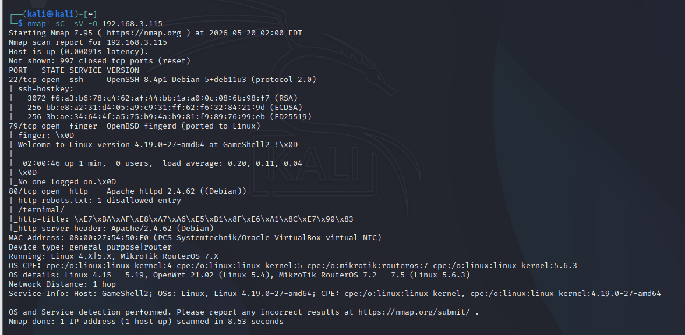

# GameShell2

[https://hackmyvm.eu/machines/machine.php?vm=Gameshell2](https://hackmyvm.eu/machines/machine.php?vm=Gameshell2)

#### **USER FLAG**

We set up this lab in VirtualBox and run a local network sweep using `arp-scan -l` to identify and isolate the target victim's IP address:



Once the target IP is confirmed, I run `nmap` to discover active network services. The scan reveals three open ports: **22 (SSH)**, **79 (Finger)**, and **80 (HTTP)**. At this stage, I analyze the function of each port to chart the attack path:

- **Port 79 (Finger):** This protocol is historically vulnerable to user enumeration, letting us verify if specific usernames exist on the host. If valid, the service returns detailed profile information.
- **Port 80 (HTTP):** Navigating to the web interface presents a simple game (shown below), devoid of any login portals or input forms. Inspecting the DOM/DevTools yields no valuable clues or hidden parameters.
- **Port 22:** Standard OpenSSH service.

**⇒ Strategy:** Since the web application offers no interactive injection points, we must perform Fuzzing to locate hidden files or directories. Correlating this with the open Port 79, our logical objective is to uncover a file containing a list of potential usernames (e.g., `users.txt`, `users.html`). 

Rather than guessing blindly, a structured directory brute-force run is essential to capture files that the author might have customized (such as `uSer`, `users_list`, etc.). Once we harvest this list, we will feed the entries into Port 79 to identify real system users.


To execute directory fuzzing for hidden assets, I use **`ffuf`** (Fuzz Faster U Fool) for its speed. Anticipating a user list file (typically formatted as `.txt` or `.html`), I configure the fuzzing run as follows:

```
ffuf -u http://192.168.3.115/FUZZ -w /usr/share/wordlists/dirb/common.txt -e .txt,.html 
```

- `-u http://192.168.3.115/FUZZ`: Sets the target URL, using the keyword `FUZZ` to specify the insertion point for dictionary entries.
- `-w /usr/share/wordlists/...`: Points to the basic wordlist on the Kali host.
- `-e .txt,.html`: Appends these extensions to each wordlist item (vital for locating a file like `users.html` instead of just matching directories).

Within seconds, `ffuf` yields highly relevant results:


**Analysis:** The initial fuzzing output contains significant noise representing **403 Forbidden** errors on files like `.ht*` due to default Apache directory security settings. To streamline the results and focus strictly on accessible files, I apply the `-fc 403` flag to filter out all forbidden requests:


With the noise filtered out, `ffuf` isolates 4 distinct endpoints of interest. I proceed to analyze and eliminate them systematically:

- **`index.html`** and **`robots.txt`**: Both return a `200 OK` status. However, `index.html` is the game portal we already examined, and `robots.txt` merely references the `/_terminal/` directory identified during our initial port scan. I skip these.
- **`terminal`**: Interestingly, this endpoint returns a **`401 Unauthorized`** status, confirming the directory exists but is protected by basic HTTP authentication. This is an immediate target for brute-forcing, though we currently lack a valid **Username**.


- **`users.html`**: This page returns `200 OK` with a file size of 2052 bytes. The name itself strongly indicates it holds the user database we need. Navigating to `http://192.168.3.115/users.html` reveals a list containing multiple usernames.


Now that we have harvested the candidate usernames, I copy them into a local file named `userss.txt` to verify which users are genuinely registered on the system by exploiting the Finger service (Port 79).

Initially, I ran the automated `finger-user-enum` tool from PentestMonkey. However, the script finished scanning and incorrectly reported all 677 attempts as valid users.


**Analysis:** The target server employs a classic defensive "Rabbit Hole." The Finger service is configured to always return a generic banner `Welcome to Linux version...` regardless of whether the queried user exists. Because the automation script relies on naive negative matching (looking for specific error messages), it interpreted the presence of the welcome banner as a successful match for every attempt, rendering the output useless.

**Bypassing the Trap with a Custom Script:**

Since the welcome banner disrupted simple negative filtering, I audited the server's responses manually to identify behavioral differences between existing and non-existing accounts.

Auditing revealed a critical distinction: invalid users return only the welcome banner before the socket closes. However, for a valid account on the system, the `finger` service returns actual system metadata fields such as `Login`, `Directory`, and `Shell`.

Leveraging this behavior, I shifted to a **Positive Matching** strategy. I wrote a custom Bash script to iterate through the harvested `userss.txt` file and flag queries that return the keyword "Login":

```bash
#!/bin/bash
HOST="192.168.3.115"

echo "[*] Launching targeted user enumeration..."
while IFS= read -r user; do
    # Skip empty lines
    [ -z "$user" ] && continue

    output=$(finger "$user@$HOST" 2>&1)

    # Positive Filter: Only alert if output contains the "Login" metadata field
    if echo "$output" | grep -qi "Login"; then
        echo "[+] Valid System User Found: $user"
    fi
done < userss.txt
```

After making the script executable (`chmod +x`) and running it, our positive filter instantly isolated the single authentic system user: **`dt`**.

I manually queried the user to confirm the profile before moving to the next stage:


Returning to the `/terminal` endpoint requiring basic authentication (**401**), we now possess the valid username `dt`. I proceed to brute-force the password using `Hydra` against the `rockyou.txt` dictionary, recovering the credentials: **`dt:purple1`**.


Authenticating to `http://192.168.3.115/terminal` with `dt:purple1` loads an interactive Snake game. The application requires us to achieve a target **Score: 15**. Once completed, the interface prints a new password: **`0t4tdtlt`**.


Recalling our initial port scan which showed an open **SSH service (Port 22)**, having a valid system username (`dt`) and a newly obtained password (`0t4tdtlt`) immediately points to our next step: establishing an SSH session.


I connect via SSH and read `user.txt` to capture the first flag:

> **User Flag:** `flag{user-3529555bd8220350defe5d0430784920}`

**User Compromised.**


---

#### **ROOT FLAG**


Having established a shell session as `dt`, I began auditing the system. I noticed the presence of `phpsploit` inside the home folder—an open-source post-exploitation framework designed to maintain persistent, stealthy command-and-control channels via PHP backdoors.

This strongly indicates that a PHP backdoor might already be active on the system ⇒ we must locate this backdoor on the web server.

Since Port 80 hosts Apache, I audited the Apache server configurations to identify local Virtual Hosts that might not be visible from external network sweeps:


I discovered an **undocumented** Virtual Host named `dev.astra.dsz` mapping to the local root directory `/var/www/dev`. The `dev` prefix suggests a development environment—often plagued by weak security controls and an ideal home for a PHP backdoor.

Checking filesystem permissions for the web directory:

```bash
dt@GameShell2:~$ ls -la /var/www/
drwx------ 2 www-data www-data 4096 Nov 21 06:49 dev
```


`/var/www/dev` is restricted to `700` and owned by `www-data`, meaning our current user `dt` cannot read it on the filesystem. However, since the Apache service running under `www-data` serves this path over HTTP, we can access it externally by mapping the domain name to the target IP inside our `/etc/hosts` file:

```text
192.168.3.115   dev.astra.dsz
```


Navigating to the domain confirms that a persistent **PHP backdoor** is active on the server, waiting to receive connections from a phpsploit client. The puzzle pieces align perfectly: the author left `phpsploit` in the home directory to guide us to interact with this backdoor.

**EXPLOITING THE BACKDOOR & ESCALATING PRIVILEGES**

I start the `phpsploit` client on my attack machine and initiate the connection:

```text
phpsploit
phpsploit> set TARGET http://dev.astra.dsz/backdoor.php
phpsploit> exploit
```

Once the interactive session under `www-data` is established, I audit the user's `sudo` privileges using `sudo -l` (executing system commands in phpsploit via the `run` prefix):

```text
phpsploit(dev.astra.dsz)> run sudo -l
```


The query reveals an extremely vulnerable privilege definition:
`User www-data may run the following commands on GameShell2:`
`(ALL) NOPASSWD: /usr/local/bin/uv`

**Abusing `uv` to Escalate to Root (GTFOBins):**

`uv` is a modern, high-performance Python package and environment manager. Crucially, the `uv run` command allows execution of arbitrary system commands within its virtual environments. Since the binary can be run via `sudo` without a password, we can exploit `uv run` to execute arbitrary system commands with root privileges.

To retrieve the root flag, I simply call `cat` on the root flag path via `uv run` with root execution privileges:

```text
phpsploit(dev.astra.dsz)> run sudo /usr/local/bin/uv run cat /root/root.txt
```


The system outputs the final root flag:

> **Root Flag:** `flag{root-983b0f2b5412aadd94ed08f249355686}`

**Root Compromised.**

---

#### **ATTACK KILL CHAIN & EXPLOITATION FLOW**

Below is the complete, logical attack kill chain for compromising GameShell2:

**Phase 1: Gaining Initial Access (User: dt)**
1. **Network Reconnaissance:** Perform an ARP sweep to isolate the target IP, followed by an `nmap` scan to identify active ports: `22 (SSH)`, `79 (Finger)`, and `80 (HTTP)`.
2. **Web Discovery:** Auditing Port 80 loads a game page. We use `ffuf` to scan for hidden directories, filtering out `403` noise via `-fc 403` to discover `/terminal` (401 Unauthorized) and `users.html` (user database).
3. **Bypassing the Finger Trap:** The Finger service attempts to spoof scanners by returning a generic welcome message for all queries. We write a custom Bash script to perform positive filtering on the `Login` keyword, revealing the single authentic system user: `dt`.
4. **Credential Recovery:** We brute-force the `/terminal` authentication portal using `Hydra` against `dt`, retrieving the credentials: `dt:purple1`.
5. **Interactive Challenge:** Logging in to `/terminal` requires reaching score 15 in the Snake game, which yields the SSH password: `0t4tdtlt`.
6. **SSH Foothold:** We log in via SSH as `dt` to capture the User Flag.

**Phase 2: Local Privilege Escalation**
1. **Backdoor Identification:** We observe `phpsploit` in the home directory and audit Apache virtual host files to locate the hidden development server: `dev.astra.dsz` (`/var/www/dev`).
2. **Backdoor Interaction:** We register `dev.astra.dsz` in `/etc/hosts` and use the local `phpsploit` framework to establish a connection to the active `backdoor.php` file, spawning a shell as `www-data`.
3. **Root Privilege Escalation:** Running `sudo -l` as `www-data` shows a passwordless sudo entry for `/usr/local/bin/uv`. We abuse the packages execution mechanism by running `sudo uv run cat /root/root.txt` to capture the Root Flag.

---

#### **KEY TAKEAWAYS & LESSONS LEARNED**

1. **Evading Defensive "Rabbit Holes":** Scanners must not rely blindly on automated negative filtering. When servers return false success banners, verifying authentic behaviors manually and writing custom scripts tailored to positive matching bypasses the trap.
2. **Internal Configuration Auditing:** When standard system files offer no privilege escalation vectors, auditing application configurations (like Apache Virtual Hosts) can expose isolated internal networks or development structures hosting backdoors.
3. **Securing Modern Packages & Environment Managers:** Modern utility binaries like `uv` (similar to traditional shell executors like Python or pip) possess built-in execution engines. Granting NOPASSWD execution rights on these tools constitutes an automatic path to complete root takeover.
